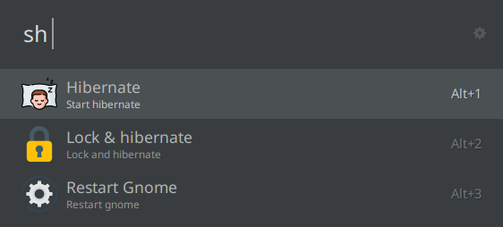

# Custom scripts

This is a Ulauncher extension to launch your own scripts.

## Table of Contents

- [Custom scripts](#custom-scripts)
  - [Table of Contents](#table-of-contents)
  - [Screenshot](#screenshot)
  - [Installation](#installation)
    - [Requirements](#requirements)
    - [Ulauncher's GUI](#ulaunchers-gui)
    - [Manually from source](#manually-from-source)
  - [Configuration](#configuration)
    - [Script file](#script-file)
  - [Usage](#usage)
  - [License](#license)

## Screenshot



## Installation

### Requirements

No external modules are required. Just install what you need for your custom scripts to work!

### Ulauncher's GUI

1. Open Ulauncher's settings and the "Extensions" tab
2. Click "Add extension" button
3. Paste this URL: `https://github.com/NastuzziSamy/ulauncher-custom-scripts`
4. Click "Add" button – the extension will be installed

### Manually from source

The extensions' directory is located at: `$HOME/.local/share/ulauncher/extensions`

Go to that location, and while being inside, just `git clone` this repository.

## Configuration

In Ulauncher's settings, you can custom some settings:
- Keyword
  - default: `sh`

### Script file

This extension allows you to start custom scripts with your shell.

To start them, you need to edit custom file `~/.config/ulauncher/scripts.json`.

Quick command to edit: `xdg-open ~/.config/ulauncher/scripts.json`.

Default script configuration:
```json
{
  "name": "Edit_scripts",
  "description": "Select to edit scripts",
  "icon": null,
  "script": "xdg-open",
  "default_arguments": [
    "~/.config/ulauncher/scripts.json"
  ]
}
```

## Usage

To launch a script, use the keyword (default is `sh`), then type/paste to search one particular script.

The first word allow you to search through your scripts name.
If no more text is given, default arguments are used to run the script. If not, use the text given as arguments.

Just click/press ENTER to start script.

## License

[MIT License](LICENSE)
